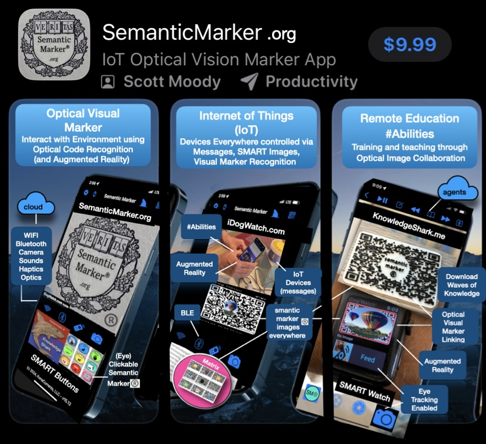

//
//  README.h
//  DynamicQRCodes
//
//  Created by Scott Moody on 4/2/26.
//

Note these few Objective-c files are representitive of the calls needed. They need to be put embedded into an app with a UI and the rest.

One such app is my Semantic Marker app 

