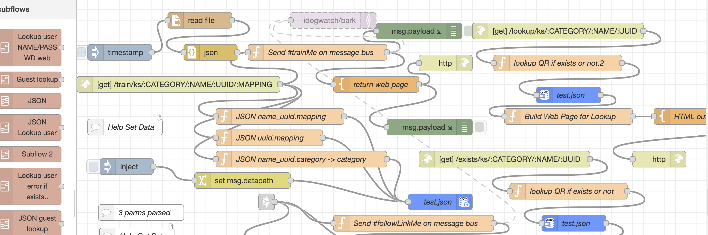

# Created by Scott Moody on 4/2/26, but from 4/2/21 design and implementations

## Sections

This DynamicQRCode open source repository is broken into the backend, implemented in 
NodeRed and would be on a server in control of the user. The code below would have
the URL of this root server embedded at appropriate places (using a _rootURL approach).

1. node-red backend (web services using REST web calls)
2. Web Pages - the frontend. This currently doesn't call this backend
3. Apple iOS Apps. The code shown is in Objective-C and shows the flow to make the appropriate GET calls.

## REST API MANUAL


The following are the main REST API calls to create and manage a Semantic Marker&reg;  . 
The current base URL for these is [SemanticMarker.org](https://SemanticMarker.org) but the entire set
can also be run locally or moved to other web servers. For the Semantic Marker&reg;   to be sharable and run
by outside parties, the Semantic Marker&reg;   address URL must be publically available 
(for example, **https://SemanticMarker.org** is globally accessible, while **http://localhost** would only be available for local use - such as a dog kennel operation.) 


The list of API calls is shown next with full details later in their appropriate sections. 

<details>
 <summary><code>Table of REST, MQTT and BLE API Calls</code> </summary>

> | name      |  description | parameters | protocol     | 
> |-----------|----------------------|---------------|------|
> | /exists/ks | query if Semantic Marker&reg; exists |{category}/{namespace} /{UUID}/{escapedSemanticMarker} | GET  |
> | /train/ks | train a Semantic Marker&reg; |{namespace}/{category} /{UUID}/{escapedSemanticMarker} | GET |
> | /lookup/ks | train a Semantic Marker&reg; |{namespace}/{category} /{UUID}/{escapedSemanticMarker} | GET |
> | /ks | run a Semantic Marker&reg; |{namespace}/{category} /{UUID} | GET |
</details>

### Train a semantic marker

<details>
 <summary><code>GET</code> <code><b>/train/ks/{namespace}/{category}/{UUID}/{escapedSemanticMarker}</b></code></summary>

##### Parameters

> | name      |  type     | data type               | description                                                           |
> |-----------|-----------|-------------------------|-----------------------------------------------------------------------|
> | namespace |  required | string                  | Namespace of Semantic Marker                                          |
> | category  |  required | string                  | Namespace of Semantic Marker                                          |
> | UUID      |  required | string                  | UUID of the user                                                      |
> | escapedAddress      |  required | string                  | The Semantic Marker Address is escaped so it is a single parameter argument|


##### Responses

> | http code     | content-type                      | response                                                            |
> |---------------|-----------------------------------|---------------------------------------------------------------------|
> | `201`         | `text/plain;charset=UTF-8`        | `Configuration created successfully`                                |
> | `400`         | `application/json`                | `{"code":"400","message":"Bad Request"}`                            |

##### Example cURL

> ```javascript
> set fullsm = "http://localhost:1880/train/ks"
> curl -v  -F username=$user -F password=$pass -F link=$link -F kind=$kind $fullsm
> ```

</details>

### Run a Dynamic QR Code

Redirects to the value specified in the `train` command above.

<details>
 <summary><code>GET</code> <code><b>/ks/{namespace}/{category}/{UUID}</summary>

##### Parameters

> | name      |  type     | data type               | description                                                           |
> |-----------|-----------|-------------------------|-----------------------------------------------------------------------|
> | namespace |  required | string                  | Namespace of Semantic Marker                                          |
> | category  |  required | string                  | Namespace of Semantic Marker                                          |
> | UUID      |  required | string                  | UUID of the user                                                      |


##### Responses

> | http code     | content-type                      | response                                                            |
> |---------------|-----------------------------------|---------------------------------------------------------------------|
> | `201`         | `text/plain;charset=UTF-8`        | `Configuration created successfully`                                |
> | `400`         | `application/json`                | `{"code":"400","message":"Bad Request"}`                            |

##### Example cURL

> ```javascript
> set fullsm = "http://localhost:1880/train/ks"
> curl -v  -F username=$user -F password=$pass -F link=$link -F kind=$kind $fullsm
> ```

</details>


### Federated Dynamic QR Factories

The power of this open-source approach with known hosts creating these Dynamic QR codes, is that
they can form a federated set of factories. This means there could be a `goodness` factor when creating a factory,
which a scanner could query to see if the QR code is from a good factory.


## Node Red web server backend

node-red.org is used as the backend, and for invoking a QR code.



The use will have to be familiar with the <a href="node-red.org">node-red</a> system.

<a href="NodeRed/flows-2.json">JSON Flows<a>

### JSON Database

Example of the JSON database for the stored dynamic QR. In each of these there are 2 entries
to help with the URL query. For example, the `hgWells_0lRVd6" below would equate to:
   
```
yourWeb/hgWells_0lRVd6/TimeTravel/UUID

```

```json
{
  "wgVmJa": {
    "mapping": "https://appleprivacyletter.com"
  },
  "AppkeBad_wgVmJa": {
    "category": "YourCategory",
    "mapping": "https://appleprivacyletter.com"
  },
  "0lRVd6": {
    "mapping": "https://en.m.wikipedia.org/wiki/H._G._Wells"
  },
  "hgWells_0lRVd6": {
    "category": "TimeTravel",
    "mapping": "https://en.m.wikipedia.org/wiki/H._G._Wells"
  },
  "BDnRcw": {
    "mapping": "https://en.m.wikipedia.org/wiki/Flatland"
  },
  "NameSpace_BDnRcw_BDnRcw": {
    "category": "YourCategory",
    "mapping": "https://en.m.wikipedia.org/wiki/Flatland"
  },
  "jzlZYf": {
    "mapping": "https://www.instagram.com/p/CTQcb2gPozQ/?utm_medium=copy_link"
  },
  "balloon_jzlZYf": {
    "category": "YourCategory",
    "mapping": "https://www.instagram.com/p/CTQcb2gPozQ/?utm_medium=copy_link"
  ,
  "ojLF4W": {
    "mapping": "https://www.instagram.com/p/CTQ9TZEMGtO/?utm_medium=copy_link"
  }
}
```

## Web Pagees

This currently is a simple web page that lets the user create QR codes. This doesn't interface with the backend. But the code
in the apple app does this interfacing.

## Apple App

A portion of a Apple iOS App that I have been using for 5+ years (2021). 

<a href="AppleApp/KSQRCodeCreations.h">Apple App</a>

